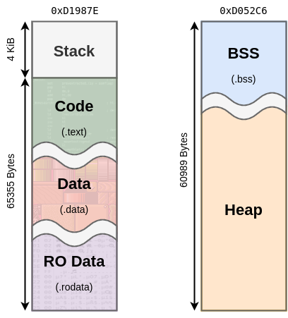

.. _faq:

Frequently Asked Questions
==========================

I Have A Bug, Help!?
--------------------

Nice work, now create an `issue report here <https://github.com/CE-Programming/toolchain/issues>`_ with details on what caused the crash.
Uploading a zip of your code and/or a minimal reproducible example is very appreciated, and will make bug fixes faster.

What is the C Runtime Memory Layout?
------------------------------------

The CE has a limited amount of memory.
The stack is roughly 4KiB bytes in size, while the bss/heap grow into each other and consume roughly 64KiB.
The following graphic breaks down the address space.

