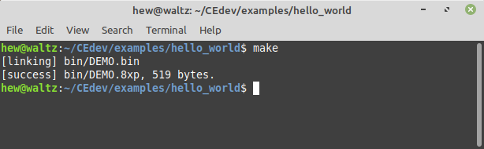

.. _getting_started:

Getting Started
===============

Installing the CE Toolchain
---------------------------

* Download the file prefixed with your OS type from `here <https://github.com/CE-Programming/toolchain/releases/latest>`_.
* Extract the zip archive to a path **without any spaces in it**.

**On Windows**

    * Double click :code:`cedev.bat` inside the extracted folder to launch the toolchain environment.
      You may have to allow the script to be run depending on the user account control.
    * If you want to avoid using the :code:`cedev.bat` script, you can extend the PATH environment variable to point to the :code:`CEdev/bin` directory.
      `Here is an example <https://www.architectryan.com/2018/03/17/add-to-the-path-on-windows-10/>`_ of how to do this.

**On Linux or macOS**

    * Extend the PATH environment variable to point to :code:`CEdev/bin` by modifying `.bashrc`, `.zshrc`, or whatever flavor your OS uses.

        .. indent with spaces
        .. code-block:: bash

            export PATH=/<insert custom path here>/CEdev/bin:$PATH

.. note::

    The toolchain requires the installation folder and any project folders to not contain any spaces.
    This is a limitation of the :code:`make` command.

Building Programs
-----------------

Programs are built with the :code:`make` command, executed from a terminal session.
This tutorial explains how to use the CE Toolchain to build programs using :code:`make`.

Locate the installed `CEdev` folder, and open a build session by double-clicking :code:`cedev.bat` on Windows or launching your favorite terminal on Linux/macOS.
Navigate to the `examples` folder using the :code:`cd examples` command.
This folder contains example projects that you can build and modify to learn how to write various programs.
Navigate the to the `hello_world` example inside this folder using the command :code:`cd hello_world`.

Type :code:`make` and press enter.
This command invokes the compiler, assembler, and linker creating the file :code:`bin/DEMO.8xp`.
The file stores the machine code of the program in a format fit for the calculator.

.. note::

    On Windows, you may need to install the latest Microsoft Visual C++ Redistributable package if you encounter errors such as :code:`Missing vcruntime140.dll`.
    The download can be found `at this link <https://support.microsoft.com/en-us/topic/the-latest-supported-visual-c-downloads-2647da03-1eea-4433-9aff-95f26a218cc0>`_, depending on your computer you will need to install one of *vc_redist.x86.exe*, *vc_redist.x64.exe*, or *vc_redist.arm64.exe*.

.. caution::

    On Windows, your antivirus software (e.g. Windows Defender) may flag binaries in the :code:`CEdev/bin` directory as false positives, and either quarantine/remove the files or prevent them from running.
    This may result in errors such as being unable find/run the `fasmg` program when building.
    It is recommended you whitelist or disable scanning in :code:`CEdev/bin` to prevent these false positives from occurring.

The `CEmu <https://ce-programming.github.io/CEmu>`_ emulator can be used to run the program, or you can transfer it to a real calculator using the cross-platform `TI Connect CE <https://education.ti.com/en/us/products/computer_software/connectivity-software/ti-connect-ce-software/tabs/overview>`_.

   Building the Hello World example

Each CE Toolchain project has the following folder structure:

* **src**

  * This is the directory where all source files can be placed.
  * Sources are built automatically if they end in a `.c`/`.cpp` extension, and can be edited with any text editor or IDE.
  * Subdirectories are allowed as long as they do not contain spaces.

* **obj**

  * Compiled C/C++ files are placed here, and contain intermediate assembly output.

* **bin**

  * This is where the final linked calculator program will be placed, ending with a `.8xp` extension.

* **makefile**

  * A text file used by :code:`make` to build the program.
  * There are options for setting the program name, description, and more.

* **icon.png**

  * This is a 16x16 icon that is displayed in shells such as `Cesium <https://github.com/mateoconlechuga/cesium/releases/latest>`_.

* **readme.md**

  * A text file that describes the program's operation.

* **autotest.json**

  * This file can be loaded into `CEmu's Autotester <https://ce-programming.github.io/CEmu>`_ to test and validate the program.
  * This feature is not required, but can be useful for creating testable code coverage.
