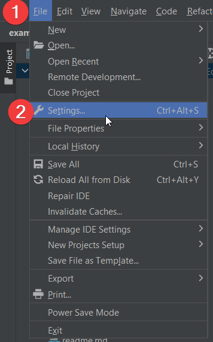
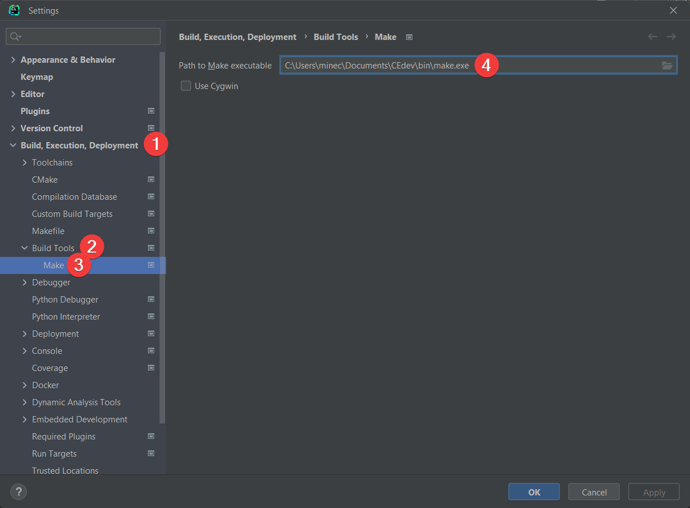
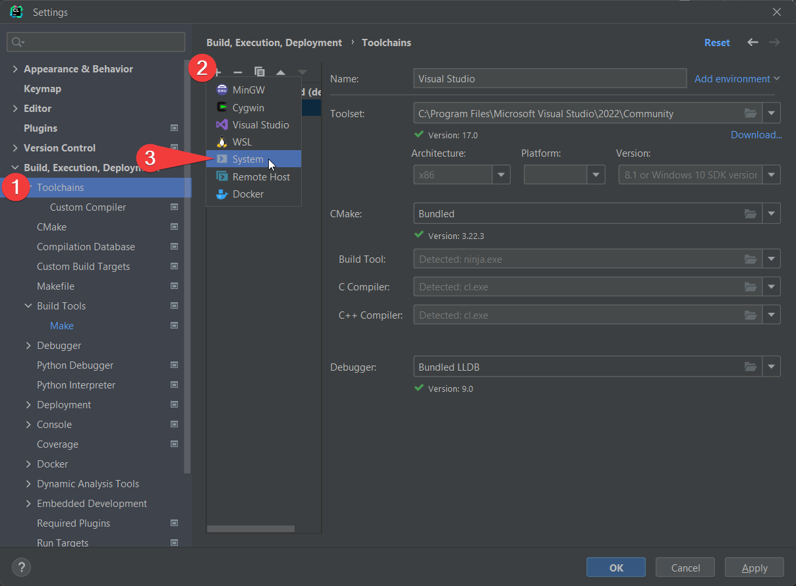
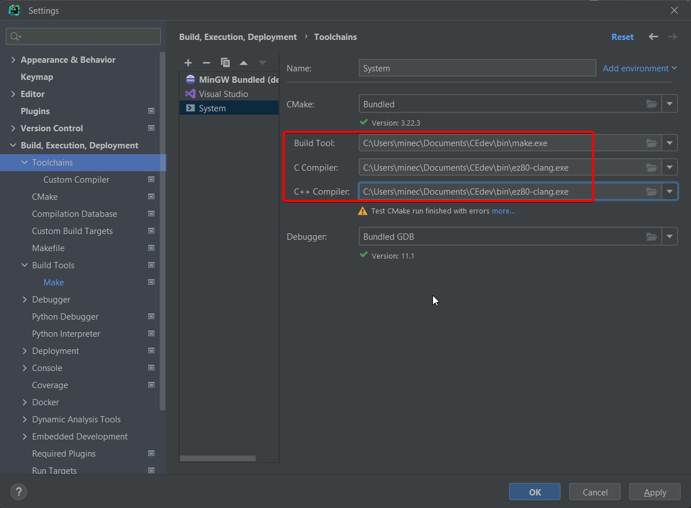
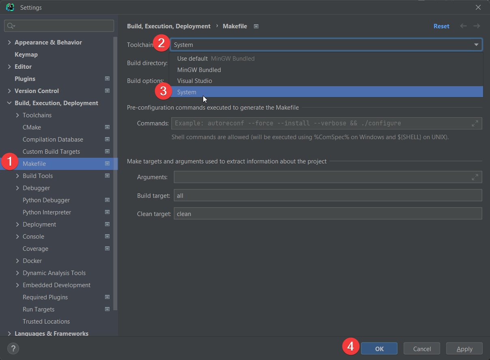

.. _ides:

Using the Toolchain in an IDE
=============================

CLion
-----

CLion is a C/C++ IDE made by JetBrains.
Open your project in CLion.
If you're making a new one, make a copy of the :code:`examples/standalone_examples/template` folder to get a boilerplate Makefile.

.. rubric:: Open IDE settings

This is found under the drop-down option (:code:`File > Settings`).

.. rubric:: (Windows Only) Configure the make executable

(*WINDOWS ONLY*) Set the :code:`make` executable (:code:`Build, Execution, Deployment > Build Tools > Make`) to your CEdev :code:`bin/make.exe` file.

.. rubric:: Create CEdev Toolchain

Navigate to the options :code:`Build, Execution, Deployment > Toolchains`, :code:`+`, :code:`System`

On Windows, set the "Build Tool" to :code:`CEdev/bin/make.exe` and both C compilers to :code:`CEdev/bin/ez80-clang.exe`

On MacOS/Linux, set both C compilers to :code:`CEdev/bin/ez80-clang`.
MacOS/Linux come with their own system :code:`make` executable, and the default system one can be used.

CLion will likely warn that "Test CMake run finished with errors".
This is safe to ignore.

.. rubric:: Enable CEdev Toolchain

Set the Makefile Toolchain (:code:`Build, Execution, Deployment > Makefile`) to your newly created toolchain.

Code assistance should be working now.
If you opened a demo project, you should be able to hover over the functions to see documentation/usage.

.. rubric:: Build

Before this step, make sure you added your CEdev :code:`bin` folder to your system's PATH environment variable, otherwise :code:`make` won't be able to find the compiler.

At the top right, 5 Run Configurations are auto-generated.

* Select "all" for the standard build.

* Select "debug" for a debug build for use with the `CEmu debugging toolchain <https://ce-programming.github.io/toolchain/static/debugging.html>`_.

* Only use the Build (the hammer icon) button with these.
  The Run icon tries to run the generated executables, which fails since .8xp files can't be run natively on PC.

Other IDEs
----------

If you know how to configure the toolchain to work with another IDE, raise an issue or pull request on `GitHub <https://github.com/CE-Programming/toolchain>`_.
