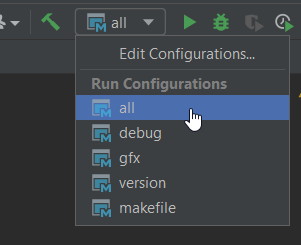
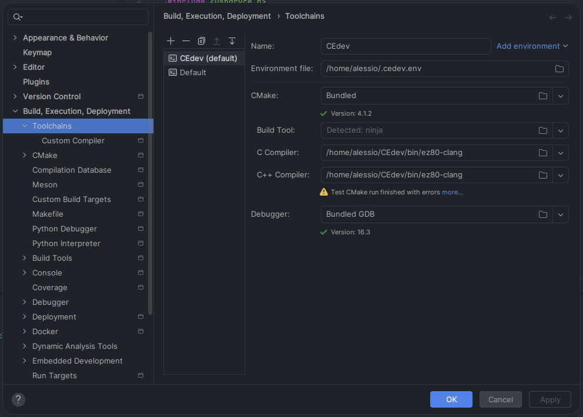
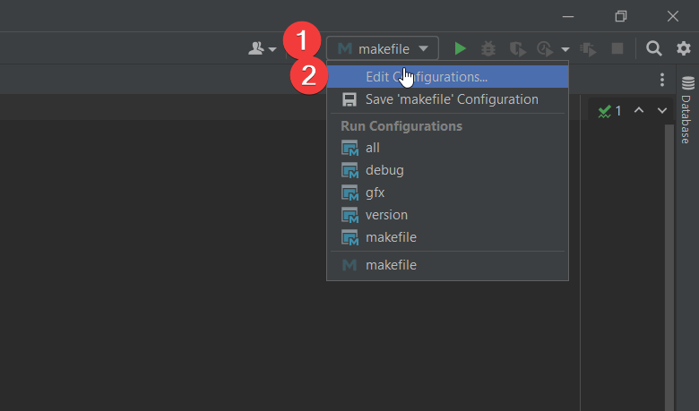
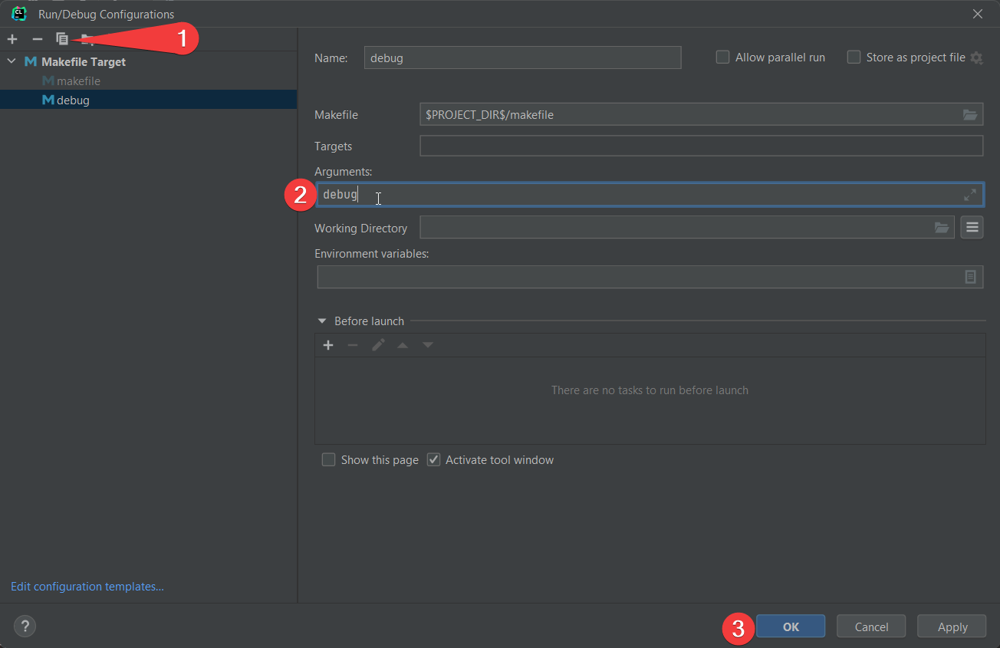

.. _ides:

Using the Toolchain in an IDE
=============================

CLion
-----
CLion is a C/C++ IDE made by JetBrains.

1. Open your project in CLion. If you're making a new one, make a copy of the :code:`examples/template` folder to get a boilerplate Makefile.

2. Open IDE settings (:code:`File > Settings`)

.. image:: images/ides_clion_1.png
   :align: center

3. (WINDOWS ONLY) Set the Make executable (:code:`Build, Execution, Deployment > Build Tools > Make`) to your CEdev :code:`bin/make.exe` file.

.. image:: images/ides_clion_2.png
   :align: center

4. Create a CEdev Toolchain

:code:`Build, Execution, Deployment > Toolchains`, :code:`+`, :code:`System`

.. image:: images/ides_clion_3.png
   :align: center

Set the "Build Tool" to :code:`CEdev/bin/make.exe` and both C compilers to :code:`CEdev/bin/ez80-clang.exe`

MacOS/Linux come with their own system Make executable, so you don't need to edit that.

On MacOS/Linux, executables have no file extension. Set both C compilers to :code:`CEdev/bin/ez80-clang`.

.. image:: images/ides_clion_4.png
   :align: center

CLion will likely warn that "Test CMake run finished with errors". This is safe to ignore.

5. Set the Makefile Toolchain (:code:`Build, Execution, Deployment > Makefile`) to your newly created toolchain.

.. image:: images/ides_clion_5.png
   :align: center

Code assistance should be working now.
If you opened a demo project, you should be able to hover over the functions to see documentation/usage.

6. Build

Before this step, make sure you added your CEdev :code:`bin` folder to your system's PATH, otherwise Make won't be able to find the right compiler.

Right click the makefile and click "Run 'makefile'"

Your project should build and the output will be in the :code:`bin` directory.

The makefile is saved as a "run configuration" in the top right for ease of use.

7. Add debug configuration

If you want to use the `CEmu debugging toolchain <https://ce-programming.github.io/toolchain/static/debugging.html>`_,
click the "makefile" run configuration in the top right, then Edit Configuration

Then add :code:`debug` to the arguments, and rename it to distinguish it from the normal one.

You can now switch between the normal and debug configurations in the top right.
