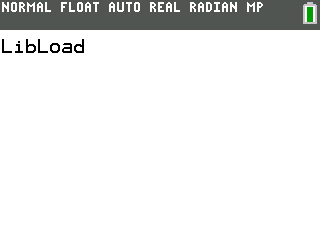

### FileIO File Detection Demo

This demo shows how to use the ti_DetectAny function to search for a variable that starts with a particular sequence of bytes
LibLoad is used because it is known to exist for demonstration.

---

This demo is a part of the C SDK Toolchain for use on the CE.

