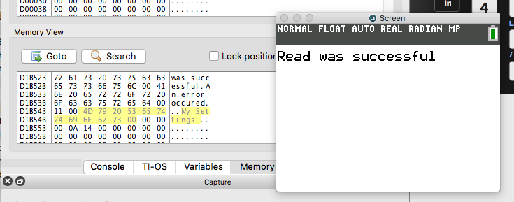

### FileIO Write/Read Demo

This example demonstrates writing some data to a file and then reading it back out to make sure it was written correctly

---

This demo is a part of the C SDK Toolcahin for use on the CE.

