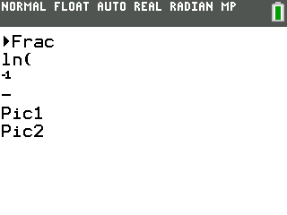

### FileIO Get Token Demo

This demo shows how to use the ti_GetDataPtr and ti_GetTokenString functions. It prints out the first two tokens in the basic prgmABC.

---

This demo is a part of the C SDK Toolchain for use on the CE.

