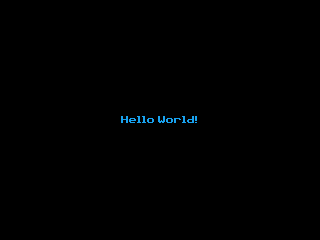

### GraphX Hello World Demo

This example of the graphics library demostrates filling the screen black and then printing `Hello World!` centered on the screen.

---

This demo is a part of the C SDK Toolchain for use on the CE.

