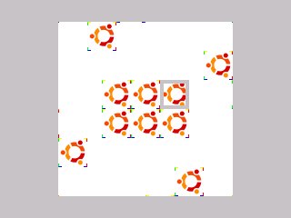

### GraphX RLETSprite Demo

Draws a sprite with RLE transparency in many clipping scenarios and converts to
and from a normal sprite with transparency. Created for testing.

---

This demo is a part of the C SDK Toolchain for use on the CE.
