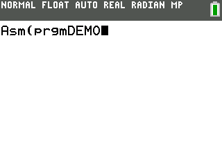

### GraphX Simple Appvar Tilemap Demo

An example of tilemaping using a sequence of tiles and the keypad. Data for the tilemap is stored within an appvar.

---

This demo is a part of the C SDK Toolchain for use on the CE.

