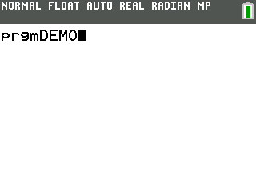

### Blitting Rectangles Demo

This example demonstrates blitting to manually copy data from the  hidden drawing buffer to the visible screen buffer.

---

This demo is part of the CE C SDK Toolchain.
