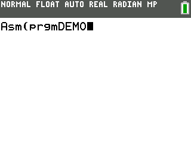

### Keypad Interrupt Demo 2

This demo changes the color of the screen while any key is being held. It uses interrupts and the on interrupt to exit.

---

This demo is a part of the C SDK Toolchain for use on the CE.

